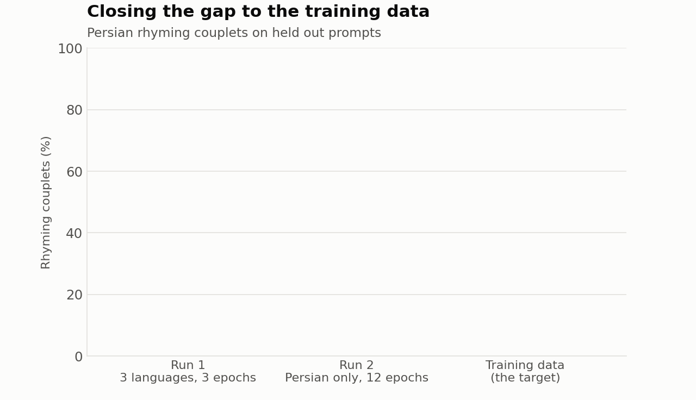
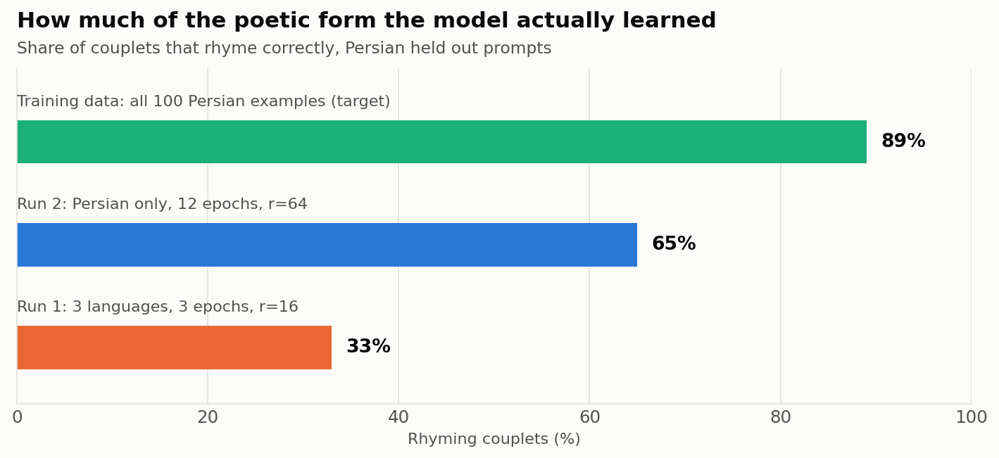
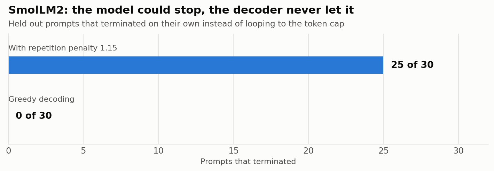
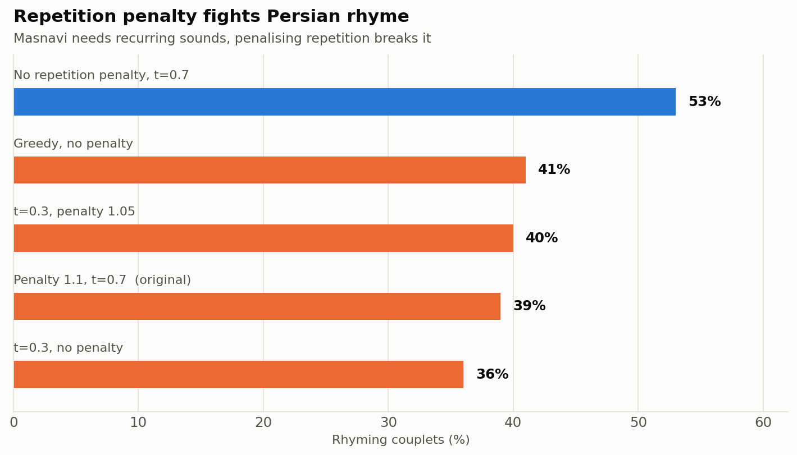
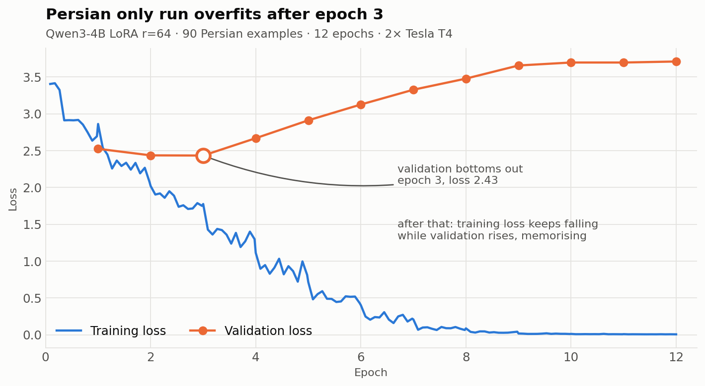

# Shahnameh SLM

**Language:** English · [فارسی](README.fa.md) · [Deutsch](README.de.md)

Teaching small language models to answer any question in the voice of Ferdowsi's
*Shahnameh*, in **Persian, English and German**, on two free Kaggle T4 GPUs.

<p align="center">
  
</p>

This repository contains the dataset, the training code, three trained models, and,
unusually, an honest record of everything that went wrong. The failures turned out to
be the most useful part, so they are documented as carefully as the successes.

**Where to get the models**

All three are published on the Hugging Face Hub at
[huggingface.co/SaeedAngiz1](https://huggingface.co/SaeedAngiz1):
[`shahnameh-qwen3-4b-fa-lora`](https://huggingface.co/SaeedAngiz1/shahnameh-qwen3-4b-fa-lora),
[`shahnameh-qwen3-4b-multilingual-lora`](https://huggingface.co/SaeedAngiz1/shahnameh-qwen3-4b-multilingual-lora) and
[`shahnameh-smollm2-360m`](https://huggingface.co/SaeedAngiz1/shahnameh-smollm2-360m).
Loading instructions are under [Running the models](#running-the-models).

**Deeper documentation**
- [How the dataset was built](docs/dataset-creation.md): created with Claude Code (Opus 5, extra high reasoning effort)
- [Unsloth and LoRA in detail](docs/unsloth-lora.md): how 4 billion parameters fit in 16 GB
- [Running Unsloth on Kaggle](docs/kaggle-unsloth.md): the operational guide covering setup, installs, both GPUs, the API, and the gotchas

---

## What it does

Ask a question in any of three languages; get an answer in Shahnameh style verse.

```
Q: رستم که بود؟

شه ترک، ای خردمند و پاکدست
که توران بدو بود، چون بیشه بکست
سپهبد بود، ای برادر مهتر
به پیش از خوانه، هیچ کس نهاده بر
چو رستم بکشت پیشانی ز هر مهر
بیامد در رخش، یکی شاخ ز گهر
تهمتن بکشت او را ز خاک زرد
به گیتی نان خواست، یکی شاخ زرد
```
*80% of couplets rhyme correctly · no script contamination · `تهمتن` and `رخش` are
authentic epic vocabulary*

```
Q: Is it better to speak or to stay silent?

Speak not for words' sake, nor without thought,
Nor when you know not what you say is worth.
For words like arrows fly from hand to hand;
One that falls false may wound a friend, and none.
```

The goal is **style, not lore**. The model is judged on meter, rhyme and classical
diction, not on whether it gets Shahnameh genealogy right. (It frequently does not.
See [Limitations](#limitations).)

---

## Results

<p align="center">
  
</p>

Persian verse in the *masnavi* form rhymes in couplets: AA, BB, CC. That makes
quality partly **measurable**: strip everything but Persian letters, compare the ends
of each line pair, and count. The training data hits 89%. That number is the target,
and the gap to it is the project's real progress metric.

| Run | Config | Persian rhyme | Script contamination |
|---|---|---|---|
| Training data | target | **89%** | none |
| Run 2 | Qwen3-4B, Persian only, 12 epochs, LoRA r=64 | **65%** | 6 chars across 10 answers |
| Run 1 | Qwen3-4B, 3 languages, 3 epochs, LoRA r=16 | 33% | none |
| SmolLM2 | 360M full fine tune, 3 languages | n/a (output was degenerate) | none |

Every number here comes from a training log or a measured evaluation in this repo.
`make_visuals.py` regenerates every chart from those files; nothing is illustrative.

---

## Why two free T4s was the right call

The whole project runs on **Kaggle's free GPU tier**: 2× NVIDIA Tesla T4, 16 GB each,
30 hours per week. Total compute spent across every run documented here is under
three hours.

**What that buys you.** A 4 billion parameter model fine tuned with 4 bit QLoRA fits
comfortably in one T4. Training the Persian only run took **724 seconds**. The
multilingual run took **411 seconds**. This is not a compromise setup for this class
of work. It is simply sufficient.

**How the second GPU is used.** Rather than splitting one job across both cards, the
default mode runs *two different jobs in parallel*: GPU 0 trains while GPU 1 generates
baseline answers from the untuned model. Baseline generation is otherwise dead time,
and you need those answers to prove the fine tuning changed anything. Distributed
training (`GPU_MODE = "ddp"`) is available but optional. See
[Problems](#problems-we-hit) for why.

**The honest caveat on reliability.** The T4s themselves never failed. But two GPU
*distributed* training did. An NCCL collective mismatch destroyed the first run's
export step after training had completed successfully. The fix was architectural, not
a retry: separate training from export into different processes. Free hardware is
reliable; distributed coordination is the fragile part.

**Constraints the T4 puts on the code.** The T4 is Turing generation: **no
bfloat16**, no FlashAttention 2. So every recipe here uses fp16 mixed precision, and
model choices are filtered by "does this work in fp16 on Turing?" That single
constraint is why Qwen3 was chosen over Gemma. See below.

---

## Design decisions, and why

Every choice below was made for a reason that can be stated. Where the reason was
wrong, that is noted too.

### Why Qwen3-4B-Instruct

The first serious candidate was Gemma 4 E4B (140 languages, excellent multilingual
coverage). It was rejected before running, on two grounds: it pins `transformers
5.10.1`, an untested stack on this account, and models in the Gemma family are the ones most
prone to NaN loss in fp16, exactly the precision a T4 forces you into. Qwen3-4B pins
`transformers 4.56.2`, which had already installed and trained successfully here, and
has strong Persian pretraining.

That call held up. Qwen3 trained first try, no NaNs.

It also produced the project's most interesting bug. Qwen3 was developed in China, and
that shows up under stress. See [Problems](#problems-we-hit).

### Why LoRA rather than full fine tuning

The 360M model was fully fine tuned; the 4B models use LoRA. At 4B, full fine tuning
does not fit in 16 GB, and with only 90 to 270 training examples it would be the wrong
tool anyway. Style transfer needs to adjust how the model writes, not rebuild what it
knows. `lora_alpha` is set equal to `r`, so the LoRA scaling factor stays at 1.0
regardless of rank; raising rank adds capacity without also amplifying the update.

**Full detail: [Unsloth and LoRA](docs/unsloth-lora.md)** covers the memory arithmetic, the
4 bit quantization, what Unsloth actually contributes, and where LoRA did *not* save us.

### Why response only loss

Training masks the prompt: `labels = [-100] * len(prompt) + answer + [eos]`. The model
is graded only on the verse it produces, never on reproducing the question. Without
this, a large share of the gradient signal goes into learning to echo prompts.

Critically, **the EOS token is inside the labels.** This is the single most common
fine tuning bug: omit it and the model never learns to stop. Verifying that it was
present is what proved the SmolLM2 repetition disaster was *not* a training fault.

### Why a custom chat template

SmolLM2 ships no chat template, so the training format is defined explicitly:

```
### System:
{system}

### User:
{question}

### Assistant:
{verse}<|endoftext|>
```

That exact string is saved into the tokenizer as `chat_template.jinja`, so
`apply_chat_template()` at inference reproduces the training format byte for byte. A
mismatch here is silent and devastating. The model sees a prompt shape it never
trained on and quality collapses for no visible reason.

### Why the validation set is never trained on

30 examples (10 per language) are held out. Every number in this README is measured on
those. With only 300 examples total the temptation to train on everything is real; the
result would be numbers that mean nothing.

**How the 300 examples were produced, and how they were validated:
[How the dataset was built](docs/dataset-creation.md).**

---

## The three models

| Model | Base | Method | Size | Best at |
|---|---|---|---|---|
| [`shahnameh-qwen3-4b-fa-lora`](https://huggingface.co/SaeedAngiz1/shahnameh-qwen3-4b-fa-lora) | Qwen3-4B-Instruct-2507 | LoRA r=64, 12 epochs, Persian only | 520 MB | **Persian verse**: 65% rhyme, peaks at 80% |
| [`shahnameh-qwen3-4b-multilingual-lora`](https://huggingface.co/SaeedAngiz1/shahnameh-qwen3-4b-multilingual-lora) | Qwen3-4B-Instruct-2507 | LoRA r=16, 3 epochs, fa/en/de | 142 MB | **Consistency**: clean script in all 3 languages |
| [`shahnameh-smollm2-360m`](https://huggingface.co/SaeedAngiz1/shahnameh-smollm2-360m) | SmolLM2-360M | Full fine tune, fa/en/de | 1.3 GB | **English only**; runs on CPU |

All three are on the Hugging Face Hub under [SaeedAngiz1](https://huggingface.co/SaeedAngiz1), with model cards carrying the same measurements as this README.

### On consistency

The two Qwen3 models trade against each other, and the trade is the point.

**Run 2 writes better Persian but is less stable.** Across ten held out prompts it
averages 65% rhyme, but individual answers range from **80% down to 60%**, and it is
the only model that leaks characters that are not Persian. Run 1 never does that, but its
Persian rhyme sits at 33%.

Output also varies **between runs of the same prompt** at `temperature=0.7`. A single
good sample is not evidence the model is good, and a single bad one is not proof it is
broken. Every figure in this README is an average over the full held out set for
exactly that reason.

The general rule this project kept running into: **the settings that fit the poetic
form hard enough to matter are the same settings that start breaking the model.**

---

## Problems we hit

Four failures, each with a different lesson.

### 1. Distributed training died after training succeeded

The SmolLM2 run completed all 51 steps across both T4s, then crashed on mismatched
NCCL ALLGATHER sequence numbers while loading the best checkpoint for export. Training
was fine. Coordination was not.

Kaggle preserved the checkpoints, so the fix was a separate single process recovery
notebook that loads the checkpoint, evaluates it, and exports, with no collectives
involved. **Lesson: do not put export in the same process as distributed training.**

### 2. Greedy decoding made a working model look worthless

<p align="center">
  
</p>

The SmolLM2 samples repeated one line until the token cap, in all three languages. The
obvious conclusion (bad checkpoint, retrain) was wrong.

Teacher forcing each gold answer and reading the next token distribution at the
position where EOS belongs showed the model assigning **P(EOS) = 0.55**, with
`<|endoftext|>` the **most likely prediction in 17 of 30 cases**. It knew exactly where to
stop. Greedy decoding just locked into a self reinforcing loop and never reached a
state where stopping was likely.

Adding `repetition_penalty=1.15` took termination from **0/30 to 25/30**. No retraining.

**Lesson: before blaming the checkpoint, measure whether it knows the right answer.**

### 3. The fix for one model was the bug in the next

<p align="center">
  
</p>

Carrying `repetition_penalty` over to Qwen3 actively **damaged** Persian verse. Masnavi
rhyme requires recurring sounds and formulaic function words (`به`, `ز`, `که`, `چو`), and
penalising repetition pushes the model away from exactly what the form demands. Removing
it raised rhyme from 39% to 53%.

**Lesson: decoding parameters are specific to each model and belong in the preset, with the
measurement written next to them.** They are in `shahnameh_unsloth_kaggle.ipynb`, with
both numbers in a comment so nobody adds the penalty back by intuition.

### 4. Training harder broke the model in a new way

<p align="center">
  
</p>

Run 2 pushed hard: 12 epochs, rank 64, higher learning rate. Validation loss bottomed
at **epoch 3 (2.43)** and climbed to **3.71** by epoch 12 while training loss fell to
**0.84**. Textbook memorisation.

Rhyme improved anyway, from 33% to 65%, which is why `load_best_model_at_end` was
deliberately set to `False`: for style transfer, the epoch with the lowest validation loss is
not the best model, and keeping it would have handed back the underfit one.

But the cost showed up somewhere loss never measures. Run 2 began emitting characters
from **other scripts** inside Persian verse:

> `که لغزش، دل را کند تیره‌眼`

`眼` is Chinese for "eye". The model reached for a word about sight and grabbed the
Chinese token instead of the Persian `چشم`. Qwen3 was developed in China, so those tokens
carry high prior probability throughout; overfitting degraded the output distribution
until it stopped reliably suppressing them. Latin (`az`) and Cyrillic (`ен`) leaked the
same way. Run 1 had zero such characters.

**Lesson: validation loss does not capture every failure mode. Measure the thing you
actually care about**: here, script purity and rhyme, neither of which loss sees.

---

## Limitations

Stated plainly, because a model that writes confident verse is easy to overrate.

- **Facts are frequently wrong.** The English model has called Rostam the servant of
  "King Tamerlane" (a 14th century figure, ~400 years after Ferdowsi wrote), invented
  his horse's name, and made Sohrab his brother rather than his son. 90 to 270 examples
  teach voice, not genealogy.
- **Persian is not verified as *good* Persian.** Rhyme and script purity are measured
  mechanically. **Meter (عروض), grammar and classical register have never been reviewed
  by a native Persian speaker.** A 65% rhyme rate says the form is partly learned; it
  does not say the verse scans.
- **Invented words persist.** Words that do not exist, such as `ستوس`, `خامور` and `بهاز`, appear in
  Persian output at every setting tried.
- **German is fluent but off domain**, drifting into unrelated imagery.
- **Quality varies run to run.** Judge on averages, not favourites.

### What would actually fix this

The dataset is clean but small: **90 Persian examples cannot teach classical prosody.**
Every hyperparameter change so far has traded one defect for another.

The real fix is authentic text. Ferdowsi's Shahnameh is public domain, roughly 50,000
genuine couplets. The standard two stage recipe:

1. Continued training on raw authentic couplets: learns real meter and diction from Ferdowsi
2. Fine tune on the Q&A pairs: learns the answer format on top

Right now one small dataset is asked to teach both *what to say* and *how to say it*.
It cannot do both.

---

## Running the models

### Downloading from Hugging Face

Every model lives on the Hugging Face Hub under
[SaeedAngiz1](https://huggingface.co/SaeedAngiz1). SmolLM2 is a complete set of
weights and loads on its own. The two Qwen3 models are LoRA adapters and load on top of
`Qwen/Qwen3-4B-Instruct-2507`, which the Hub fetches for you.

```python
# SmolLM2, the full model, CPU is enough
from transformers import AutoModelForCausalLM, AutoTokenizer

model_id = "SaeedAngiz1/shahnameh-smollm2-360m"
tok = AutoTokenizer.from_pretrained(model_id)
model = AutoModelForCausalLM.from_pretrained(model_id)
```

```python
# Qwen3 adapter on top of the base model, GPU needed
from transformers import AutoModelForCausalLM
from peft import PeftModel

base = AutoModelForCausalLM.from_pretrained("Qwen/Qwen3-4B-Instruct-2507", device_map="auto")
model = PeftModel.from_pretrained(base, "SaeedAngiz1/shahnameh-qwen3-4b-fa-lora")
```

To fetch the files without loading them, and to put SmolLM2 where `ask_smollm2.py`
expects it:

```bash
hf download SaeedAngiz1/shahnameh-smollm2-360m --local-dir smollm2-shahnameh-model
```

### On your machine (SmolLM2, CPU, no GPU needed)

```bash
python ask_smollm2.py "Who was Rostam?"
python ask_smollm2.py --lang fa "رستم که بود؟"
python ask_smollm2.py --temperature 0.8 "What is wisdom?"
```

Loads in ~25 seconds on CPU. English is the usable language on this model.

### On Kaggle (Qwen3, the good Persian)

The Qwen3 models need a GPU for 4 bit quantization. The
[`shahnameh-ask`](https://www.kaggle.com/code/saeed010/shahnameh-ask) notebook provides
a chat box: run the cells, type a question, and it prints the answer along with its
rhyme percentage and any characters that are not Persian, so output can be judged rather than
taken on trust.

### Reproducing training

`kaggle/shahnameh_unsloth_kaggle.ipynb` is the source of truth. Upload the 8 JSONL
files from `training_data/` as a Kaggle dataset, attach it, set the accelerator to
**GPU T4 x2** with internet on, and Run All. All settings live in one cell at the top.

---

## Repository layout

```
├── training_data/                  300 examples: 100 prompts × fa/en/de, 90/10 split
├── shahnameh_style_dataset.xlsx    dataset source of truth (glossary, style guide, stats)
├── export_jsonl.py                 xlsx → JSONL with validation
├── kaggle/
│   ├── shahnameh_unsloth_kaggle.ipynb   Qwen3 + Unsloth training (source of truth)
│   ├── train_smollm2.py                 SmolLM2 full fine tune, 2 GPU DDP
│   ├── recover_smollm2.py               single process checkpoint recovery + export
│   └── SMOLLM2_RESULTS.md               detailed SmolLM2 findings
├── qwen3-fa-only-run2/             run 2 samples + training log
├── qwen3-shahnameh-lora/           run 1 adapter config + samples
├── ask_smollm2.py                  CPU inference script
├── make_visuals.py                 regenerates every chart from the logs
└── docs/
    ├── dataset-creation.md         how the dataset was built (+ .fa.md, .de.md)
    ├── unsloth-lora.md             Unsloth & LoRA deep dive (+ .fa.md, .de.md)
    ├── kaggle-unsloth.md           running it on Kaggle, operationally (+ .fa.md, .de.md)
    └── assets/                     charts and animations
```

Model weights are on the Hugging Face Hub, not here. They range from 132 MB to 1.4 GB,
and GitHub caps files at 100 MB.

---

## Credits

- **[Unsloth](https://github.com/unslothai/unsloth)**: 2× faster LoRA fine tuning, 4 bit loading
- **[Qwen3-4B-Instruct-2507](https://huggingface.co/Qwen/Qwen3-4B-Instruct-2507)** (Alibaba): Apache 2.0
- **[SmolLM2-360M](https://huggingface.co/HuggingFaceTB/SmolLM2-360M)** (Hugging Face): Apache 2.0
- **[Kaggle](https://www.kaggle.com/)**: free 2× T4 GPU compute
- **Claude Code (Opus 5)**: [dataset creation and validation](docs/dataset-creation.md)
- **Abu'l-Qāsim Ferdowsi**: the *Shahnameh*, completed 1010 CE

The training verse is newly written in Ferdowsi's style; it is not his text.

## License

Code and dataset: **Apache 2.0**. Model adapters inherit the Apache 2.0 licenses of
their base models.
